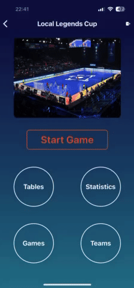
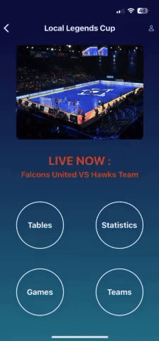

# Futsal app

This repository contains code for the Futsal app which is used to track live scores and ... for futsal tournaments and leagues.

Re-distributing content provided with this repository is not permitted.

## Demo

  

    <b>Tournaments Overview</b> 
    
  

  

    <b>Live Admin Screen</b> 
    
  

    

    <b>User Live Match Screen</b> 
    
  

### Tournament Main Screens

Get an overview of all tournaments:

### Admin Live Match Screen

Manage live matches seamlessly:

### User Live Match Screens

Stay updated with live match details:

## Repository Structure

- `adminScreens/` - Contains the screens and components related to the admin interface of the application. Admin is an user which has log in to torunament system.
- `components/` - Reusable React Native components used throughout the application.
- `constants/` - Contains constant values that are used throughout the application for consistency and ease of maintenance.
- `python/` - Contains Python scripts for backend operations, simulations, and management tasks.
- `screens/` - Contains the different screens or views of the React Native application.
- `store/` - Contains context providers and state management related files.
- `util/` - Contains utility functions for interacting with the backend and other services.
- `App.js` - The main entry point of the React Native application.
- `app.json` - Configuration file for the React Native application.

# Creating a New Tournament

To create a new tournament, please follow these steps:

1. **Send an Email**:

   - Address the email to: [leonimail100@gmail.com](mailto:leonimail100@gmail.com)
   - Include the following information in your email:
     - **Tournament Name**
     - **Date**
     - **Image** (attach an image for the tournament)
     - **Match Length**

2. **Admin Processing**:

   - After receiving your email, the admin will create new tournament and user.
   - You will receive an email from the admin containing your username and password, which you will use to log in to the tournament system.

3. **User Actions**:

   - **Login**: Use the provided username and password to log in.
   - **Create Teams and Players**: Set up your teams and players within the system.
   - **Create Games**:
     - You can manually create games.
     - Alternatively, use the auto-generate feature available in the Games screen. If you use auto-generate, you must manually modify the date and time for the games.

4. **Live Mode**:

   - The created games will be immediately available in live mode.

5. **Advancing Stages**:
   - Once all games in the tournament phase are finished, you can auto-generate games for the new stages.
