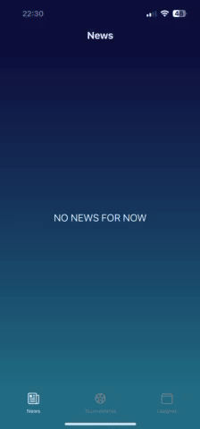

# Futsal app

This repository contains code for the Futsal app, which is used to track live scores and manage futsal tournaments and leagues.

### Note on Excluded Files and Screens

Please note that this repository does not include all files and screens necessary for the complete functionality of the application. The excluded files and screens are part of the final version of the app, which will be available on the App Store and Google Play.

## Demo

The Futsal app offers a comprehensive solution for tracking live scores and managing futsal tournaments and leagues. Below are some of the key features demonstrated in the app:

## Repository Structure

- `adminScreens/` - Contains the screens and components related to the admin interface of the application. The admin is a user who has logged in to the tournament system.
- `components/` - Reusable React Native components used throughout the application.
- `constants/` - Contains constant values that are used throughout the application for consistency and ease of maintenance.
- `python/` - Contains Python scripts for backend operations, simulations, and management tasks.
- `screens/` - Contains the different screens or views of the React Native application.
- `store/` - Contains context providers and state management related files.
- `util/` - Contains utility functions for interacting with the backend and other services.
- `App.js` - The main entry point of the React Native application.
- `app.json` - Configuration file for the React Native application.

# Creating a New Tournament

To create a new tournament, please follow these steps:

1. **Send an Email**:

   - Address the email to: [leonimail100@gmail.com](mailto:leonimail100@gmail.com)
   - Include the following information in your email:
     - **Tournament Name**
     - **Date**
     - **Image** (attach an image for the tournament)
     - **Match Length**

2. **Admin Processing**:

   - After receiving your email, the admin will create new tournament and user.
   - You will receive an email from the admin containing your username and password, which you will use to log in to the tournament system.

3. **User Actions**:

   - **Login**: Use the provided username and password to log in.
   - **Create Teams and Players**: Set up your teams and players within the system.
   - **Create Games**:
     - You can manually create games.
     - Alternatively, use the auto-generate feature available in the Games screen. If you use auto-generate, you must manually modify the date and time for the games.

4. **Live Mode**:

   - The created games will be immediately available in live mode.

5. **Advancing Stages**:
   - Once all games in the tournament phase are finished, you can auto-generate games for the new stages.

---

Creating a new firebase app

{
"rules": {
".read": "now < 1759280000000", // December 30, 2024
".write": "now < 1759280000000", // December 30, 2024
}
}

GamesGenerator explained

1. Group stage

GROUPS {"A": [{"id": 17, "points": 0, "team": "Cheetahs FC"}, {"id": 1, "points": 0, "team": "Falcons United"}, {"id": 9, "points": 0, "team": "Hawks Team"}], "B": [{"id": 10, "points": 0, "team": "Dragons Squad"}, {"id": 2, "points": 0, "team": "Eag}}...

2. Second round

sortedGroups {"A": [{"id": 17, "points": 6, "team": "Cheetahs FC"}, {"id": 1, "points": 1, "team": "Falcons United"}, {"id": 9, "points": 1, "team": "Hawks Team"}], "B": [{"id": 2, "points": 6, "team": "Eagles FC"}, {"id": 10, "points": 3, "team": "Dragons Squad"}}
